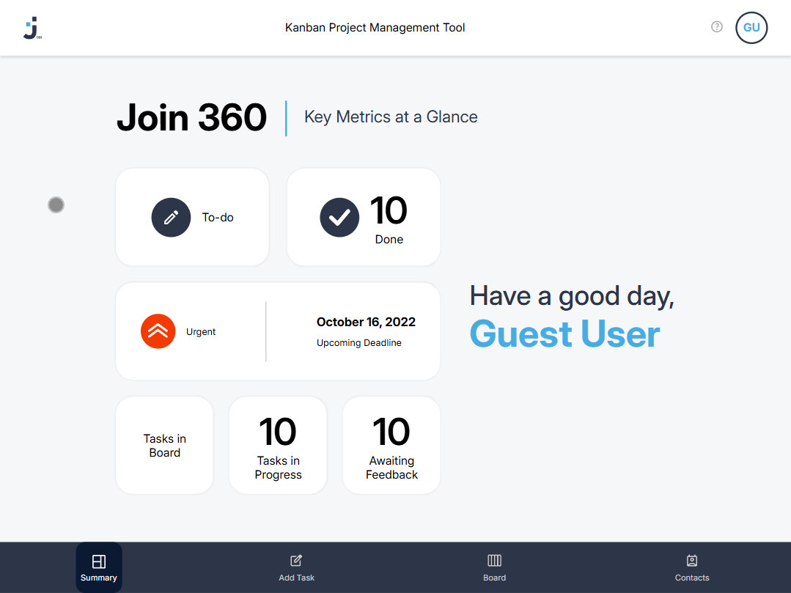

# Join – Frontend

Browser-based Kanban task manager. Create and organize tasks, manage contacts, and track your workflow — all with drag and drop.



## Live Demo

[join.lutz-boelling.de](https://join.lutz-boelling.de)

## Tech Stack

- JavaScript (ES6+)
- HTML5
- CSS3

## Features

- Kanban board with drag-and-drop
- Task creation with title, description, due date, priority, and assignees
- Contact management
- Summary dashboard
- Responsive design

## Pages

| File | Description |
|------|-------------|
| `index.html` | Login / Landing |
| `summary.html` | Dashboard overview |
| `board.html` | Kanban board |
| `addtask.html` | Create new task |
| `contacts.html` | Contact management |

## Getting Started

```
git clone https://github.com/eXactDevFlaw/join-frontend.git
cd join-frontend  # Open index.html in your browser
```
No build step required. Connects to the Join backend API.

## Related

Backend: [Backend](https://github.com/eXactDevFlaw/join-backend)

Live: [join.lutz-boelling.de](https://join.lutz-boelling.de)

## Team
Built in a team of 3. I led the project as team head, responsible for code structure and timeline coordination.
